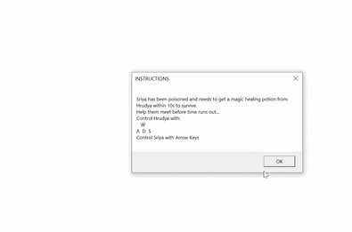

# Maze-Cocos2Dx
Maze is a 2-player cross-platform game designed using Cocos2D-x, where Player1 &amp; Player2 have been seperated in a labrynith. Player1 has been poisoned and needs to get a magic healing potion from Player2 within 10s to survive. The labrynith is a 13x13 maze with only one possible route between the players. If the two characters can meet on time, the game generates another maze with the same size and time-limit. In case of failure, the game ends. Player2 can be controlled with A,W,S &amp; D keys and Player1 can be controlled with Arrow Keys.

[Cocos2D-X Installation](https://cocos2d-x.org/download)

[Cocos2D-X V4 Documentation](https://docs.cocos2d-x.org/cocos2d-x/v4/en/)

After installation and cocos project creation, the Classes file in the created project should be replaced by the Classes file given here. Similarly, the Resources file in the created project should also be replaced.

For project creation from command prompt, 
$ cocos new -l <language> -p <companyName> -d <projectName>
 
For project compilation and running,
$ cocos compile -s <path to your project> -p <platform> -m <mode> -o <output directory>
$ cocos run <path to your project> -p <platform>
  
The Spritesheet used in this game was created using TexturePackerGUI. It contains the background image for our game, the Road & Block tiles and 4 images displaying the two characters in our game in different poses.

A soundtrack “Storybook.mp3” licensed under Creative Commons has been supported as background music through the use of SimpleAudioEngine API.

